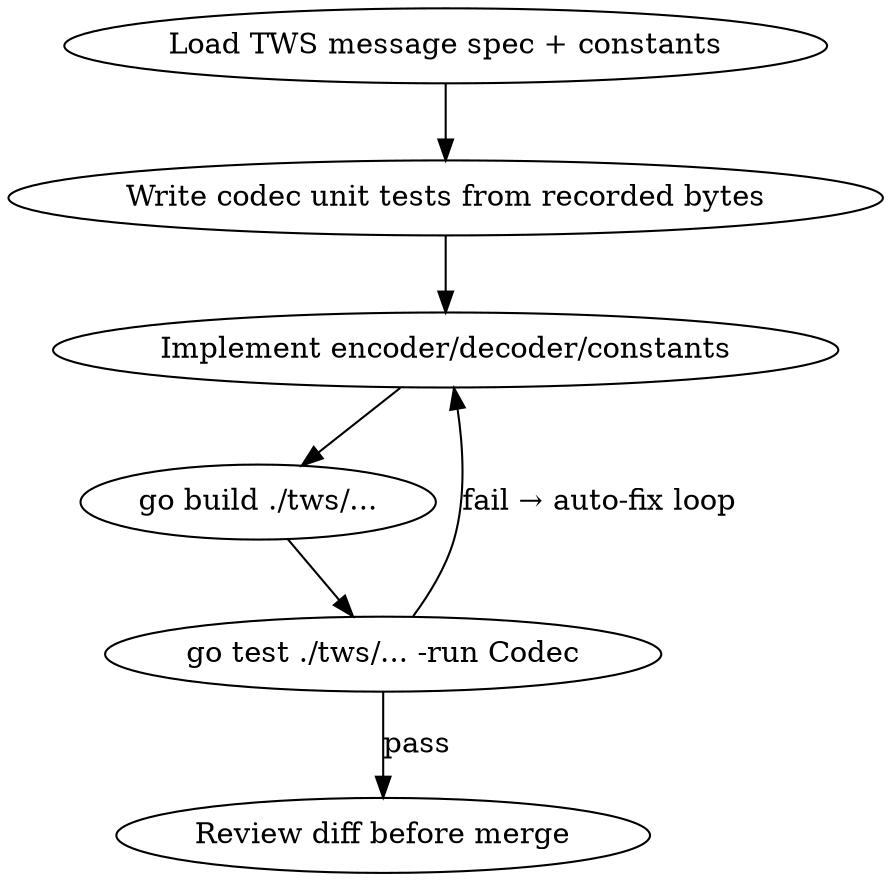

# OpenProphet → IBKR Migration Plan v2

> Supersedes the spring plan in `CLAUDE.md` / `PROGRESS.md`. Refreshed against the **actual repo tree** (only step 1.1 was ever completed) and **TWS API 10.44+** (the repo still pins 10.37.02).
>
> **Working rules (unchanged):** one step = one commit = one testable change · never skip ahead · mark ✅ only after the test passes · Claude confirms the full plan before writing code · no file modifications without explicit instruction · wait for confirmation before the next step.

---

## 0. What changed since the spring plan

| Area | Spring plan | Now (verified) |
|---|---|---|
| TWS API version | 10.37.02 | **10.44+** is current. Pin to the 10.44 line. |
| Tick sizes | int | On 10.44+, `Last_Size` (5) and `Delayed_Last_Size` (71) return **Decimal**, not Integer. The decoder must parse these as decimals. |
| Fundamentals | assumed available | `reqFundamentalData` / `cancelFundamentalData` (+ProtoBuf variants) were **removed** in the 2026 release. Any fundamentals path can't use TWS — source it elsewhere (or drop it). |
| Heartbeat smoke test | `reqCurrentTime` | New `reqCurrentTimeInMillis()` available — use it as the Phase-2 liveness probe. |
| Open-order reconciliation | — | `reqOpenOrders` now **includes de-activated orders**; status logic must filter them. |
| Broker seam | assumed exists | **Does not exist.** `services/alpaca_*.go` are concrete; there's no `BrokerService` interface. Building the seam is the real first code step. |
| Transport choice | TWS via IB Gateway | **Unchanged and still correct.** The Web/Client-Portal REST API has a ~6-min session timeout, a 10 req/s cap, and a single-session constraint that fights an always-on agent. IB Gateway + TWS socket avoids daily re-auth and coexists via client IDs. IBKR explicitly supports a custom wrapper in any language — TWS is just a TCP message protocol. |

---

## Architecture (target)

```
Dashboard (Node, 3737)
  ├── Agent Harness (harness.js) ── claude -p  (CLI swap = independent track, see Appendix B)
  └── MCP Server ── HTTP ──► Go Backend (Gin, 4534)
                                ├── controllers/      (unchanged HTTP handlers)
                                ├── services/
                                │     ├── broker.go            NEW  BrokerService interface
                                │     ├── market_data.go       NEW  MarketDataService interface
                                │     ├── alpaca_*.go          becomes one impl behind the interface
                                │     ├── ibkr_broker.go       NEW
                                │     └── ibkr_market_data.go  NEW
                                └── tws/                       NEW  custom Go TWS wrapper (from scratch)
                                      ├── client.go      TCP connect, handshake, framed I/O
                                      ├── encoder.go     outbound message builder
                                      ├── decoder.go     inbound message parser
                                      ├── constants.go   msg IDs, tick types (note Decimal change)
                                      ├── contract.go    Contract type ↔ Instrument
                                      ├── order.go       Order type
                                      └── dispatcher.go  reqId/orderId → channel registry
```

Design spine: **build IBKR alongside Alpaca behind one interface, switch via a `BROKER=` flag.** Nothing is ripped out until IBKR paper trading is proven.

---

## Phases (each ends in a workable, testable result)

### Phase 0 — Baseline & harness
| # | Step | Test / workable result |
|---|---|---|
| 0.1 | Branch `feature/ibkr-porting` (exists on main; cut a fresh working branch). Snapshot clean tree. | `git status` clean; branch pushed. |
| 0.2 | IB Gateway paper running on **4002**; record build + API version. | Login succeeds; version logged in `CLAUDE.md`. |
| 0.3 | Raw socket sanity: connect to 4002, send the API handshake prefix, read server version. | A throwaway Go `main` prints server version + connection time. **Proves the socket path before any wrapper code.** |

### Phase 1 — Broker abstraction seam (no behaviour change)
| # | Step | Test / workable result |
|---|---|---|
| 1.1 | Define `BrokerService` + `MarketDataService` interfaces in `services/` from the methods the controllers actually call. | Compiles; interfaces capture every call site. |
| 1.2 | Make existing Alpaca code satisfy the interfaces (thin adapter, no logic change). | App still trades on **Alpaca paper**; all controller endpoints behave identically. |
| 1.3 | Wire controllers/MCP to the interface, selected by `BROKER=alpaca`. | Full autonomous beat on Alpaca, now routed through the interface. **Seam proven with zero regression.** |

### Phase 2 — TWS wrapper (`tws/`), protocol only, **no orders**
| # | Step | Test / workable result |
|---|---|---|
| 2.1 | `client.go`: connect, v100+ handshake, `nextValidId` seed, framed read loop. | Handshake returns server version + first valid order id. |
| 2.2 | `encoder.go` + `decoder.go` + `constants.go`: message framing both ways. | Round-trip `reqCurrentTimeInMillis()` → epoch ms. |
| 2.3 | `dispatcher.go`: `reqId → chan` registry (Go equivalent of your `ConcurrentHashMap<orderId, CompletableFuture>`). | Two concurrent requests resolve to the right callers. |
| 2.4 | `contract.go` + `reqContractDetails` for **OESX**. | Returns conId, multiplier, expiries for a real OESX contract. |
| 2.5 | Market data subscribe; parse ticks incl. **Decimal** sizes (5, 71). | Live OESX bid/ask/last ticks print; sizes decode as decimals. |

> Phase 2 is fully unit-testable against **recorded message bytes** — no live socket needed for the codec. This is the layer where Fabro fits (see below).

### Phase 3 — IBKR read-only services
| # | Step | Test / workable result |
|---|---|---|
| 3.1 | `ibkr_market_data.go` implements `MarketDataService` over `tws/`. | Quotes/Greeks for OESX match TWS UI. |
| 3.2 | `ibkr_broker.go` read paths: account summary, positions, open orders (filter de-activated). | Values match TWS paper account exactly; **no order placed.** |

### Phase 4 — Order execution (paper, manual, tightly gated)
| # | Step | Test / workable result |
|---|---|---|
| 4.1 | `placeOrder` / `cancelOrder` + `orderStatus`/`openOrder` callbacks via the dispatcher. | 1-lot OESX **paper** order places, fills, reconciles. |
| 4.2 | Bracket orders (the reason for leaving DEGIRO/Alpaca). | Parent + TP + SL submitted atomically; OCA behaves on partial fill. |
| 4.3 | `BROKER=ibkr` end-to-end autonomous beat on paper. | Agent wakes → assesses → places/manages a paper trade → sleeps. |

> Phase 4 stays **human-in-the-loop, confirm-each-step**. Not a candidate for autonomous orchestration — this is the path that can send money.

### Phase 5 — Cutover & instrument-agnostic polish
| # | Step | Test / workable result |
|---|---|---|
| 5.1 | Contract mapping for US/EU stocks + futures alongside OESX options. | Each instrument type round-trips contractDetails + a paper order. |
| 5.2 | News/feeds → European sources; remove dead fundamentals path. | `news_service` returns EU sources; no calls to removed `reqFundamentalData`. |
| 5.3 | Default `BROKER=ibkr`; Alpaca demoted to fallback. | Clean autonomous run on IBKR paper from a cold start. |

### Phase 6 — Later / optional
Live (port **4001**) behind an explicit double-confirm guard · Java backend migration · merge the Claude Code CLI swap track (Appendix B).

---

## TWS wrapper spec (the from-scratch part)

- **Transport:** single TCP socket to IB Gateway. v100+ handshake: send `API\0` + framed `v{MIN}..{MAX}` range, read server version + connection time, then `startApi` with clientId.
- **Framing:** every message is a 4-byte big-endian length prefix + `\0`-delimited fields. Encoder writes typed fields → byte stream; decoder splits on `\0` and dispatches by leading message ID.
- **Concurrency:** one reader goroutine fans out to per-`reqId` channels via `dispatcher.go`. Callers block on their channel with a timeout. This is the idiomatic Go form of your Java `CompletableFuture` map.
- **Versioning:** gate decode logic on server version where fields were added/changed (esp. the 10.44 Decimal tick sizes). Keep a `constants.go` table of message IDs + tick types.
- **No third-party TWS library** — conform to the published message layout directly.
- **Safety invariants:** paper (4002) is the default and only target until Phase 6; every order path logs intent before send; live requires an explicit flag the agent cannot set on its own.

---

## Should you use Fabro Dark Factory? — Scoped yes

Fabro orchestrates AI coding agents as DOT-graph workflows with **build/test gates that trigger auto-fix loops**, model-per-stage stylesheets, and a long-running server. Its sweet spot is mechanical, well-specified work behind a strong automated gate.

**Where it genuinely helps: Phase 2 only — the TWS codec.** The encoder/decoder/constants/contract work has a precise published spec and is unit-testable against recorded bytes with no live socket and no money at risk. That's an ideal auto-fix-loop target: the test suite *is* the spec, so an agent grinding until green produces real value.

**Where it does not fit:** Phases 1, 3, 4, 5. The order-execution path can send trades, and your whole working style for this project is deliberately tight-leash (confirm each step, no file changes without instruction). Fabro's value is removing the human from the loop — the opposite of what you want anywhere near order flow or the paper/live boundary. Pointing an autonomous committer at those phases trades away the discipline that matters most.

**Net:** use it as a force-multiplier for the codec grind, keep everything that touches orders manual. Prereqs before running it: clean working tree, a dedicated branch (it commits autonomously), and the Phase-2 test suite written *first* so the gate is real.

### Sketch Fabro workflow — scoped to the codec (`tws-codec.dot`)

Stylesheet idea: a strong model on `impl`/`spec`, a cheap fast model on the fix-loop iterations. The `human` approval node keeps the merge under your control even though the grind is automated.

---

## Appendix A — Verification quicklist
- Phase 0 done = raw socket prints server version from 4002.
- Phase 1 done = unchanged Alpaca behaviour through the new interface.
- Phase 2 done = live OESX ticks decode (Decimal sizes), no orders.
- Phase 3 done = paper account/positions match TWS exactly, no orders.
- Phase 4 done = 1-lot OESX paper order + bracket fills and reconciles.
- Phase 5 done = cold autonomous run on IBKR paper.

## Appendix B — Independent track: Claude Code CLI swap
The OpenCode → `claude -p` swap (old PROGRESS.md Phase 1, steps 1.2–1.7) is **orthogonal** to the broker port — it can be done anytime against the Alpaca backend and merged later. Not on the IBKR critical path.
