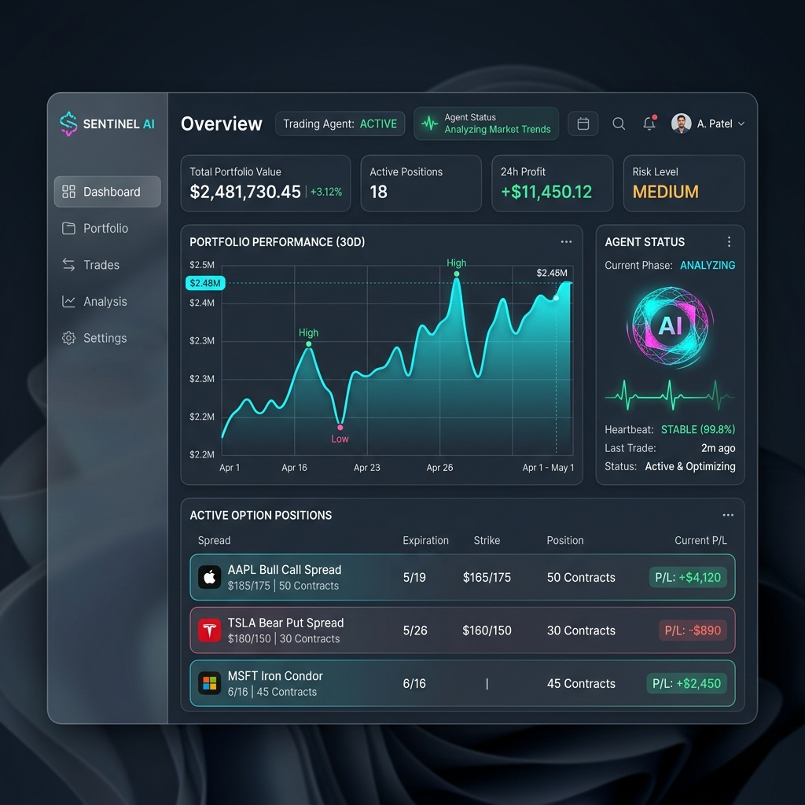

# Dashboard Ideation & Design Plan

Based on the original `openprophet.io` aesthetics and our newly built "Supervised Autonomous Beat" logic, I've designed a concept for a state-of-the-art Web Dashboard tailored specifically for an AI Options Trading agent.

## Core Design Philosophy
The UI must feel like a premium, professional command center rather than a simple retail brokerage. It should employ a **"Glassmorphism"** aesthetic with a sleek dark mode (deep slate backgrounds, neon cyan/magenta accents) and modern typography (Inter).

## Key Dashboard Sections

### 1. Agent Telemetry (The "Heartbeat")
Unlike a traditional dashboard, the focal point here is the AI itself.
- **Current Phase:** Displays what the agent is currently doing (e.g., "Scanning Market," "Analyzing Options Chain," "Pending Authorization").
- **Activity Log:** A live feed trailing the agent's thought process and API calls.

### 2. Human-in-the-Loop Authorization Center
Since we just built Phase 4.3e requiring explicit human token authorization:
- **Pending Intents:** A dedicated queue showing trades the AI wants to make.
- **Action Buttons:** One-click `[Authorize]` (injects the `ADMIN_TOKEN`) or `[Reject]` buttons.
- **Trade Rationale:** Expanding a pending intent shows the AI's reasoning, Greeks, and exactly why it wants to enter a specific spread.

### 3. Options-Selling Portfolio View
Tailored specifically to your trading rules:
- **Active Spreads:** Grouped by strategy (e.g., "ESTX50 Call Credit Spread").
- **Metrics:** Highlighting Theta (time decay), probability of profit, and current P&L.
- **Performance Chart:** A sleek, glowing line chart showing portfolio growth.

## Technical Stack Proposal

### Frontend Framework
- **Vite + React** (Fast, aligns with the original openprophet.io structure).
- **Styling:** Custom Vanilla CSS with CSS Variables for theme tokens, or TailwindCSS if preferred.
- **Animations:** Framer Motion for sleek micro-interactions (hover states, modal pops, and the glowing "Heartbeat" pulse).

### Backend Integration
- The dashboard will communicate directly with the Golang API routes we've been building (e.g., `GET /api/v1/positions/managed`, `GET /api/v1/beat/intents`, and `POST /api/v1/beat/authorize/:intent_id`).
